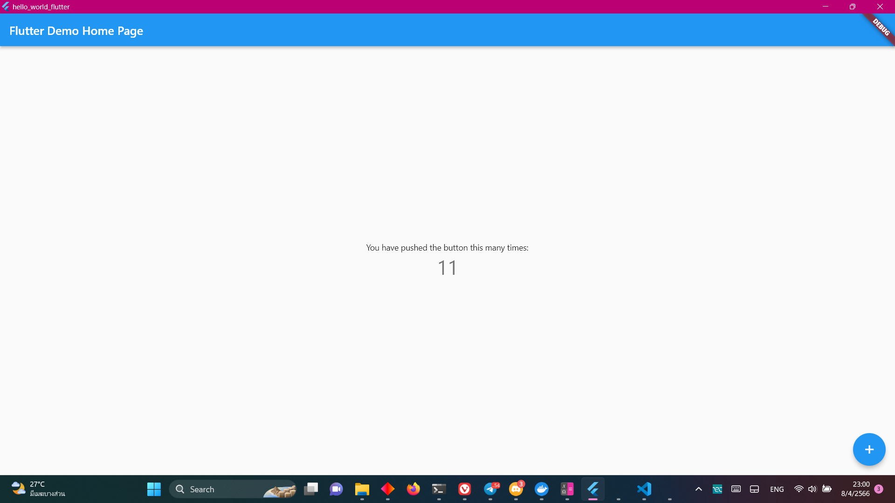

# hello_world_flutter

A new Flutter project.

## Getting Started

This project is a starting point for a Flutter application.

A few resources to get you started if this is your first Flutter project:

- [Lab: Write your first Flutter app](https://docs.flutter.dev/get-started/codelab)
- [Cookbook: Useful Flutter samples](https://docs.flutter.dev/cookbook)

For help getting started with Flutter development, view the
[online documentation](https://docs.flutter.dev/), which offers tutorials,
samples, guidance on mobile development, and a full API reference.

## Pictures
image 1/4 createwing a new project in Windows Terminal

image 2/4 trying to run the new project in Windows Terminal

image 3/4 the project is now running

image 4/4 showing the UI of the program
