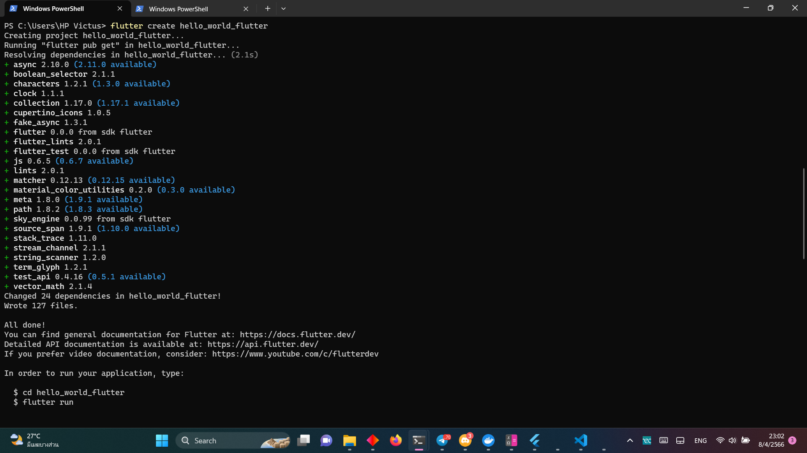
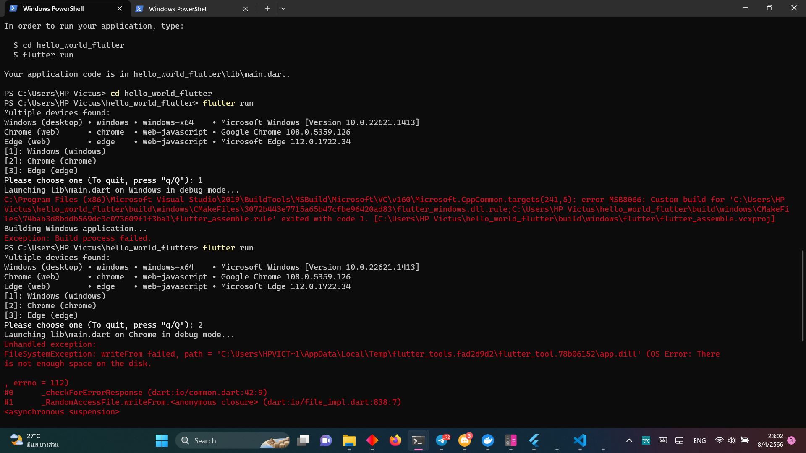
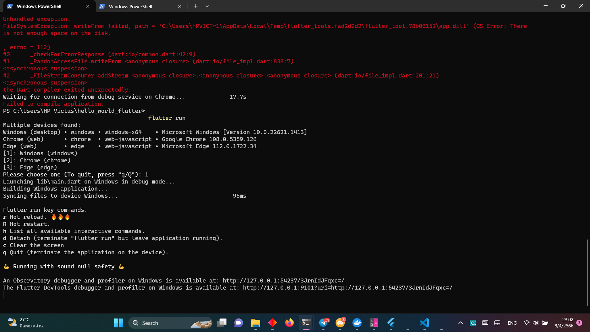
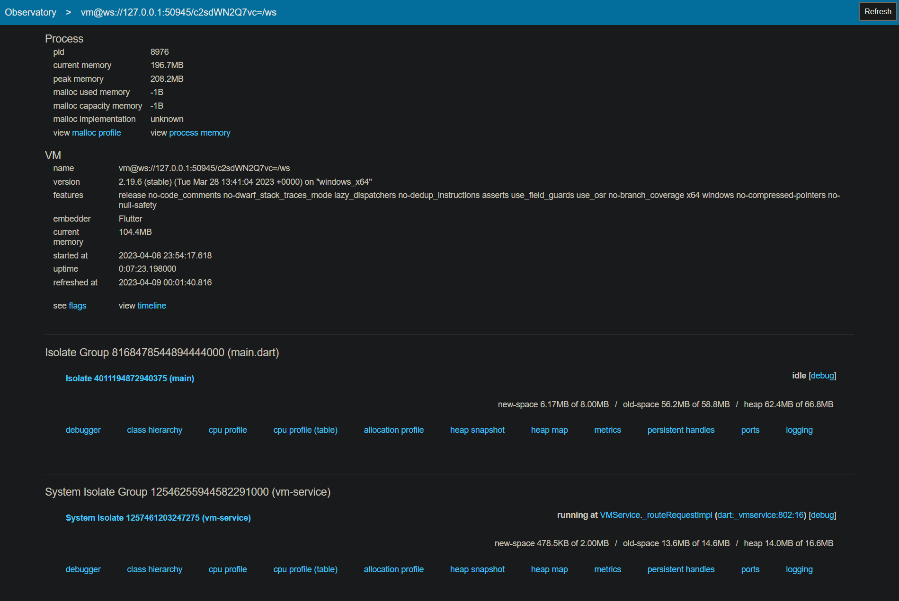
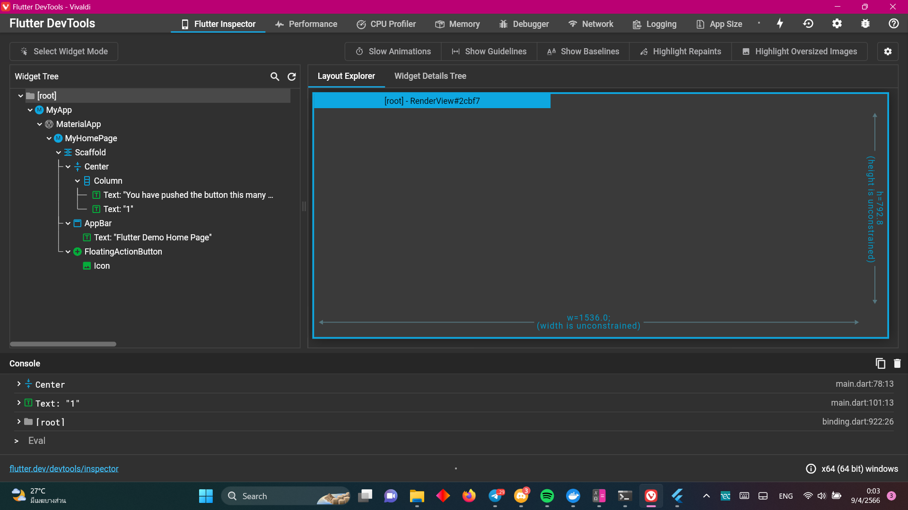

# hello_world_flutter

A new Flutter project.

## Getting Started

This project is a starting point for a Flutter application.

A few resources to get you started if this is your first Flutter project:

- [Lab: Write your first Flutter app](https://docs.flutter.dev/get-started/codelab)
- [Cookbook: Useful Flutter samples](https://docs.flutter.dev/cookbook)

For help getting started with Flutter development, view the
[online documentation](https://docs.flutter.dev/), which offers tutorials,
samples, guidance on mobile development, and a full API reference.

# Images & Videos
## Terminal
image 1 - creating a new project

image 2 - trying to run the new project

image 3 - the project is now running

## Showing the UI of the program
video 1 - the UI in action
[img/3.mp4 "the UI in action"](https://fxtwitter.com/bigcozyorca/status/1644913244296056832?t=eZfM6liVrugJ7IkcQ6PeWg&s=19)
## debugger and profiler
image 4 - An Observatory debugger and profiler on Windows is available at: http://127.0.0.1:50945/c2sdWN2Q7vc=/

image 5 - The Flutter DevTools debugger and profiler on Windows is available at: http://127.0.0.1:9101?uri=http://127.0.0.1:50945/c2sdWN2Q7vc=/

